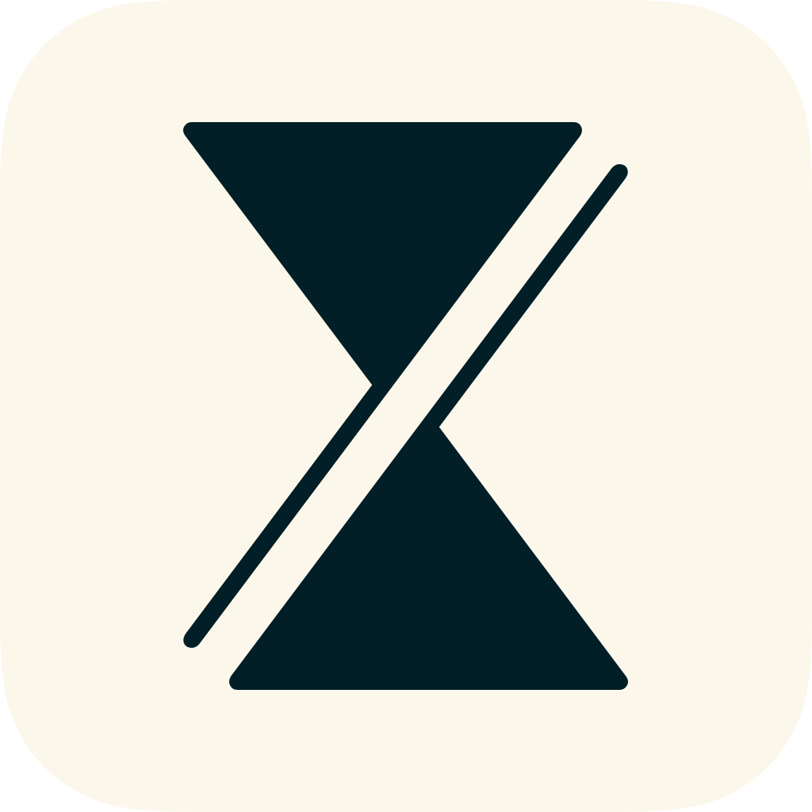
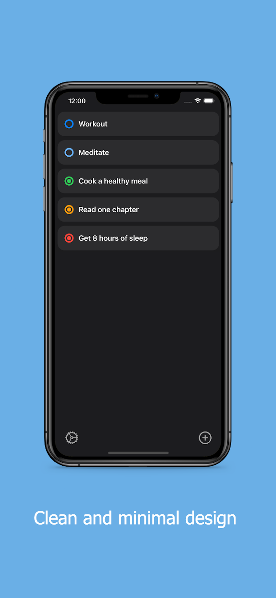
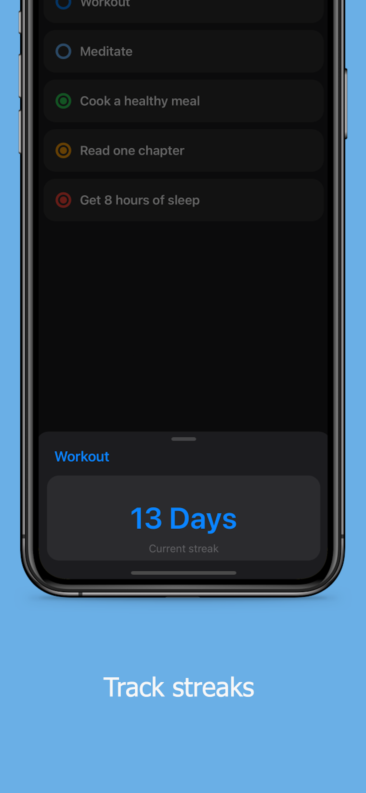
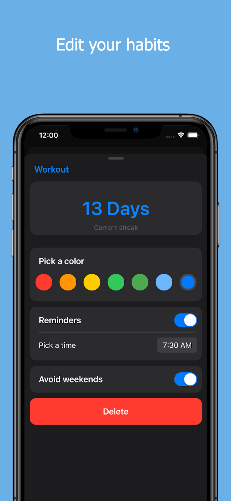
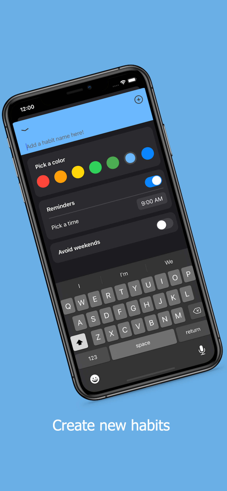

# Procrast

<p align="left">
    
</p>

<!-- TABLE OF CONTENTS -->
<details open="open">
  <summary>Table of Contents</summary>
  <ol>
    <li><a href="#about-the-project">About the project</a></li>
    <li><a href="#features">Features</a></li>
    <li>
      <a href="#getting-started">Getting started</a>
      <ul>
        <li><a href="#prerequisites">Prerequisites</a></li>
        <li><a href="#installation">Installation</a></li>
      </ul>
    </li>
    <li>
        <a href="#roadmap">Roadmap</a>
        <ul>
            <li><a href="#upcoming-features">Upcoming features</a></li>
        </ul>
    </li>
    <li><a href="#built-with">Built with</a></li>
    <li><a href="#license">License</a></li>
  </ol>
</details>

## About the project
Procrast is a habit tracking app written in Swift that is available in the App Store


[](https://apps.apple.com/us/app/procrast-habit-tracker/id1586877316)

<div style="text-align: center">
    
    
    
    
</div>

## Features

* Create habits
* Edit habits
* Track streaks
* Set reminders
* Avoid weekends

<!-- GETTING STARTED -->
## Getting Started

### Prerequisites

* Swift 5.0+
* iOS 14.0+
* Xcode 12+
* Realm 10.15+

### Installation


1. Clone the repo

   ```sh
   git clone https://github.com/ekalons/Procrast
   ```

<!-- ROADMAP -->
## Roadmap

### Upcoming features
- [ ] Allow user to rearrange habits
- [ ] Release iPad app & offer sync with iCloudKit
- [ ] Implement FaceID/TouchID verification

## Built with
- [Swift](https://developer.apple.com/swift/)
- [Realm](https://www.realm.io)
- [CocoaPods](https://www.cocoapods.org)

## License

Procrast is available under the MIT license. See the [LICENSE](https://github.com/ekalons/Procrast/blob/main/LICENSE.md) file for more info
